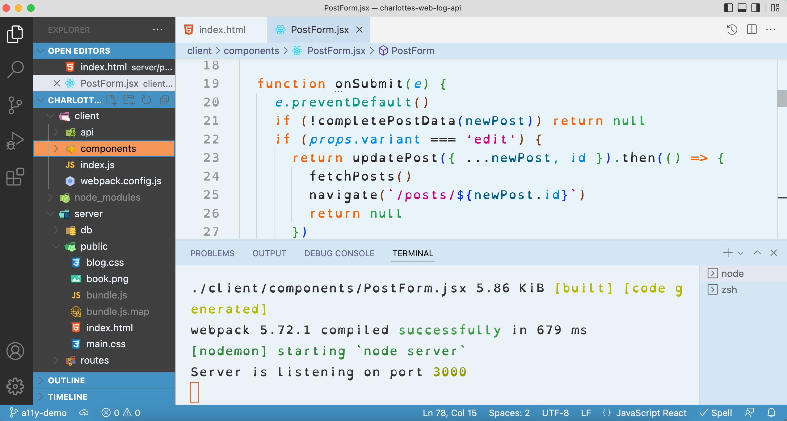

# Readible

A tool for quickly setting up a baseline for a more readable VS Code experience. This includes many customizations recommended for users with dyslexia, including VS Code extensions, a lower-contrast color theme, and an open-source typeface. Different adjustments will work for different people, so this is **only a starting point**. I highly recommend testing additional customizations to see what works best.

## What's included

### Extensions:
- The [dislexic color theme](https://github.com/SpeedyLom/dislexic-vscode), with some modifications to reduce contrast
- [Code Spell Checker](https://marketplace.visualstudio.com/items?itemName=streetsIDEsoftware.code-spell-checker)
- [VS Code Icons](https://marketplace.visualstudio.com/items?itemName=vscode-icons-team.vscode-icons)

### Style and appearance
- Use of [the Open Dyslexic typeface](https://www.opendyslexic.org/)
- Font size, line height, zoom adjustments
- Minimap disabled, whitespace characters hidden

### Code profiles
If desired, rather than using these settings as your default, you can set up a separate VS Code profile to run with Readible settings when triggered by a specific alias. This may be useful if you want to use one theme when coding alone and an alternate configuration for pair programming or live coding demos, for example.

## To use
- Clone the repo, `npm install`, and `node .` from the root of the project.
- Ideally, you should be able to accept all the default settings offered by the prompts. Here's more detail on each:
  1. Choose to either modify your default code profile or create a new one. A new one is useful if you want to use the accessible settings separately from your existing setup, for example, only when doing live code demos.
  2. Select where you'd like your new font file to go -- probably with your other fonts. You may wish to check the write permissions on this directory.
  3. If creating a new code profile, choose the command you'd like to use to run it. Also specify where you'd like it to be stored.
  4. If not creating a new code profile, specify where to find your existing settings. You can find this file by opening your settings.json from VS Code command palette.
- The script should install everything or at least provide some useful feedback, including instructions for how to complete any steps it had trouble with.

Alternately, the object in userconfig.js can be un-commented and populated with the same information, if you prefer, before running `node .`

You will either see an immediate change in your VS Code appearance (if you chose to modify your default code profile) or you can run your chosen command to start a new instance of VS Code which will use the alternate profile.

## Acknowledgements
- Jenn Hall for [Personalising VSCode for Dyslexia](https://jenn-hall.medium.com/personalising-vscode-for-dyslexia-60aac1a36b4d) from which _many_ suggestions have been drawn
- SpeedyLom for his [dislexic color theme](https://github.com/SpeedyLom/dislexic-vscode), which I have customized only slightly
- The fine folks who created [the Open Dyslexic typeface](https://www.opendyslexic.org/)
- JavaScript Joe for [How to Create Code Profiles in VSCode](https://www.freecodecamp.org/news/how-to-create-code-profiles-in-vscode/)
